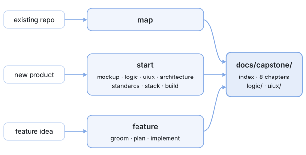

<p align="center">
  
</p>

<p align="center">
  <strong>Your agent, on rails.</strong><br>
  Every rule decided before a line is written.<br>
  Every doc read before a token is spent.
</p>

<p align="center">
  <a href="#install"></a>
  
  <a href="https://github.com/GentBajko/quarry"></a>
  <a href="LICENSE"></a>
</p>

<p align="center">
  <a href="https://www.patreon.com/cw/GentBajko"></a>
  <a href="https://buymeacoffee.com/gentbajko"></a>
</p>

<p align="center">
  Architecture docs your AI agent reads instead of re-exploring the repo
  every session. Stamped to commits, refreshed only where the code
  moved. For new projects, an interview pipeline that designs the whole
  thing before building it.
</p>

<p align="center">
  
</p>

<p align="center">
  <strong>Running a fleet of repos?</strong>
  <a href="https://github.com/GentBajko/quarry">Quarry</a> gathers every
  capstone reference into one indexed docs repo, so "what breaks if I
  change this endpoint" is a one-line query from any terminal.<br>
  Capstone writes the edges; quarry walks them.
</p>

<p align="center">
  <a href="#install">Install</a> ·
  <a href="#update">Update</a> ·
  <a href="#where-to-start">Where to start</a> ·
  <a href="#what-you-get">What you get</a> ·
  <a href="#commands">Commands</a> ·
  <a href="#the-greenfield-pipeline">Pipeline</a> ·
  <a href="#the-feature-chain">Feature chain</a> ·
  <a href="#what-review-is">Review</a> ·
  <a href="#what-retro-is">Retro</a> ·
  <a href="#not-technical-still-yours">Not technical?</a>
</p>

<p align="center">
  <strong><a href="https://archways.dev/docs/capstone/">Read the complete user manual</a></strong> · <a href="docs/manual/README.md">Markdown source</a><br>
  Full detail on every command: <strong><a href="docs/commands.md">docs/commands.md</a></strong>.<br>
  How the three run, in diagrams: <strong><a href="docs/flows.md">docs/flows.md</a></strong>.
</p>

---

## Install

### Claude Code

```text
/plugin marketplace add GentBajko/capstone
/plugin install capstone@capstone-marketplace
```

### GitHub Copilot

```bash
gh skill install GentBajko/capstone --all --agent github-copilot
```

### Any other agent

70+ editors and CLIs via the skills CLI:

```bash
npx skills add GentBajko/capstone
```

Per-agent commands and the bare-`/capstone` alias are under
"Installing on other agents" below.

## Update

No reinstall needed. Update in place:

| Installed with | Update with |
| --- | --- |
| Claude Code plugin | `claude plugin marketplace update capstone-marketplace`<br>then `claude plugin update capstone@capstone-marketplace` |
| `gh skill` | `gh skill update capstone` |
| `npx skills` | `npx skills update` |

The Claude Code pair is two steps on purpose: the first refreshes the
marketplace clone, the second moves your install onto it. Restart to
apply. To skip it entirely, turn on auto-update: `/plugin` →
Marketplaces → capstone-marketplace → Enable auto-update.

> [!IMPORTANT]
> **Updates are additive.** `gh skill update` and `npx skills update`
> refresh files but never delete a skill that capstone has retired, so
> a removed command lingers on disk and keeps being offered to your
> agent. After any release that drops commands, compare
> `gh skill list` or `npx skills list` against the command tables
> below and remove whatever is no longer there.

---

## Where to start

| Situation | Command |
| --- | --- |
| A repo that already has code | `/capstone:map` |
| A product that doesn't exist yet | `/capstone:start` |
| One change to a mapped project | `/capstone:feature add CSV export` |

Everything else is a stage one of those runs, invocable on its own
when you want to enter mid-chain.

## What you get

`/capstone:map` produces a `00-index.md`, up to nine numbered chapters
beside it in `docs/capstone/`, and a `logic/` folder mapping the
observed business logic scenario by scenario:

```text
01-architecture.md   layers, boundaries, entry points, dispatch tables
02-models.md         entities, relationships, schema DDL, validation
03-conventions.md    paradigm, typing level, error handling, DI
04-data-flow.md      lifecycles hop by hop, state ownership, failure paths
05-dependencies.md   every package, what it's for, where it's wired
06-testing.md        layout, test doubles, coverage shape
07-operations.md     how to run it, env vars, infra, deploy
08-glossary.md       the domain words your codebase invented
09-interfaces.md     cross-repo edges both ways, and the names it goes by
```

Everything is facts with `file:line` citations, never advice. Every
file records the commit it was derived at, a content hash that
survives squash and rebase merges, and the globs it covers, so
a later run rewrites only what actually moved - and every command
declares what it reads before acting, so re-runs don't burn tokens
re-exploring what the docs already know.

A command that needs the reference and finds none builds it first
instead of sending you off to run something else.

## Commands

**Reference**

| Command | What it does |
| --- | --- |
| `/capstone:map` | Build the reference, or refresh only what drifted. `rebuild` forces a full rewrite; a topic name targets one chapter |
| `/capstone:map check` | Read-only trust report in two halves: a bash script (staleness, ledger fragments, schema: stamps, `known_as`, headings, edge sites, payload sections, model references, secret shapes; the CI gate, no API key) and the model's review (pointer drift, absorption, re-vetting, coverage). Writes nothing |
| `/capstone:doctor` | Diagnose and repair the docs area: torn writes, index drift, voided approvals, absorption gaps |
| `/capstone:review [be\|fe]` | The opt-in judgment → `review.md`. No argument does both sides; `backend` takes architecture, `frontend` grades the UI against your own design docs |
| `/capstone:retro [session]` | Read a finished session for evidence, then propose edits to `standards.md` and your `AGENTS.md`/`CLAUDE.md`, one approved row at a time |

**Greenfield pipeline** - `/capstone:start` runs these in order

| Command | What it does |
| --- | --- |
| `/capstone:mockup` | Product discovery → one file per screen |
| `/capstone:logic` | Business logic, scenario by scenario |
| `/capstone:uiux` | How the UI looks and the UX behaves |
| `/capstone:architecture` | The big design interview → prescriptive chapters |
| `/capstone:standards` | How code should be written here |
| `/capstone:stack` | Research libraries and services per capability; you pick |
| `/capstone:build` | Implementation plan, your approval, then working code |

**Feature chain** - `/capstone:feature` runs these in order

| Command | What it does |
| --- | --- |
| `/capstone:groom <feature>` | Doc-grounded feature interview → a traceable spec |
| `/capstone:plan <feature>` | Task-by-task TDD plan; you approve before any code |
| `/capstone:implement <feature>` | Execute the plan, review until dry, absorb back into the docs |

Plus `/capstone:help` for usage - in Claude Code a hook answers it
before the model is invoked, so it costs zero tokens.

Not a command: `docs/capstone/changelog.md`, the ledger every writing
command records itself in before it sets its done marker. New entries
land as one file each under `changelog.d/`, so parallel doc-carrying
PRs never conflict; the next writing run on main folds them in.

**[Full command reference →](docs/commands.md)** - every argument,
output, prerequisite, ledger key, and the shared mechanics.

---

## The greenfield pipeline

```text
mockup → logic → uiux → architecture → standards → stack → build
```

Type `capstone` and it runs the stages in order, resuming wherever you
stopped. Every answer is written to disk before the next question, so
a dead session loses nothing. Each interview takes an optional
artifact (a PRD, screenshots) and pre-fills what it answers. On
existing codebases, `logic` and `uiux` run in reverse: they draft
from the observed code and you confirm.

**mockup**. Product discovery. Three fixed questions, then every
question after that is generated from your answers until nothing is
left to invent. One file per screen: ASCII wireframe, the elements and
where they lead, the states each screen has. It depicts rather than
decides - the moment an answer would be a rule, it names the behavior
and hands the question to `logic` instead of guessing a number that
would only be contradicted later. What it hands over is the list of
things the product has to decide, which is what makes the next stage
fast. No visual UI? It records your surfaces (api, cli) and the uiux
stage skips itself.

**logic**. One scenario at a time, walked until a developer could
implement it without inventing a single rule: exact steps, real
formulas, what happens when the payment fails or the user clicks
twice. The part of a spec everyone skips and then pays for. It is
exhaustive on purpose - every scenario is swept against sixteen rule
dimensions, so it finishes when each is answered or explicitly ruled
out, never when nothing else comes to mind. That is what catches the
rules with no natural question behind them: what the system
deliberately hides, what it deliberately never says, who eats the cost
when a charge fails after the money moved.

**uiux**. How it looks and feels: a design read, the visual world,
the tokens, each screen's composition and states. The method is
vendored, distilled from `impeccable` (Apache-2.0) and
`design-taste-frontend` (MIT), so the same product designs the same
way on any machine. Before the gate it writes `uiux/preview.html`, a
single self-contained page showing the committed tokens as the
flagship first viewport and a style tile, so you steer the design by
looking at it rather than by reading hex values.

**architecture**. The big interview. Done only when every section of
the future docs is answerable from your recorded decisions. Writes
the same numbered chapters, marked prescriptive; once code exists,
`map` replaces intent with observation.

**standards**. Typing strictness, library versus hand-rolled, error
handling, what an AI must never do in your repo. It sweeps seventeen
domains from an inventory - security, logging and privacy, API
conventions, accessibility, performance budgets and the rest - and is
finished only when every item is answered, accepted from the craft
file, or written down as not in play. Also a decent starting point for
a CLAUDE.md.

**stack, then build**. `stack` researches real options per
capability, licenses and prices included; you pick, and
`stack refresh` re-vets the picks months later. The capability list
comes from your own chapters rather than a stock list, and every
capability reaches you as options, writing it yourselves among them,
with the ladder recommending rather than deciding for you. `build` writes an
implementation plan, stops for your approval, then writes the code:
one subagent per step with fresh context, or inline, whichever you
pick at the start of the pipeline. Every new or resumed run asks and
waits for your answer. Inline avoids extra agent usage; subagents can
consume your allowance faster. That choice covers all stages,
research, readback, build and any reviews or reference refreshes.

Between the two, the pipeline reads all six stages' final outputs. It
moves what landed in the wrong file to the stage that owns it - a
business rule in an architecture chapter belongs in `logic` - and
raises contradictions between final files. Same terms as everywhere
else: evidence and final-file citations, two rounds at most, then your
answer stands. The corrected decisions and rationale are written into
their owning final outputs; completed interview bodies are not read or
amended.

## The feature chain

`/capstone:feature add CSV export` grows a finished project one
feature at a time. `groom` interviews a spec out of you against the
reference. `plan` turns it into a task-by-task TDD plan; a vendored
TDD + YAGNI ladder trims every task, and your standards outrank the
ladder on conflict. `implement` executes, reviews the diff until two
consecutive rounds find nothing new, then absorbs the shipped
behavior back into the scenario docs. A dead session resumes
mid-chain.

Every new or resumed feature run asks **inline or subagents** before
stage work and waits for your answer. Inline stays in one conversation
through planning, implementation, review and reference refreshes.
Subagents use fresh contexts and can consume your allowance faster.
There is no automatic default; stages carry the current run's answer,
and a later run asks again.

## What `review` is

The one command allowed opinions, only when invoked. Two sides, one
`docs/capstone/review.md`, each section carrying its own stamp so you
can tell how old each half is.

The **frontend** side judges the UI against your own design docs
first, then a vendored craft floor, then each screen's mode,
screenshotting the live app when it can. The **backend** side covers
architecture and backend: shallow modules by the deletion test,
change-smells in the git hot paths, security, stack currency.

Bare `review` runs both; one argument runs one side and rewrites only
that section. Both judge by capstone's own vendored craft files, so
the same codebase is judged the same way on any machine. One rule
outranks the craft baseline: **your recorded decisions beat generic
best practice.** Gitignored by default - it is judgment, not
reference.

## What `retro` is

`review` judges the code. `retro` judges what the agent had to work
with. Run it after a session and it reads that session for evidence,
then walks seven candidates: reference navigation, checks a machine
could run instead of a human, standards rules to add or sharpen,
steering-file lines that belong somewhere else, repeated calls a
recorded command would replace, rules that changed no behavior, and
facts the agent needed and could not reach. Each finding cites what
actually happened in the session; a candidate with no evidence behind
it is reported clear rather than filled in.

You approve the findings one row at a time. Approved rules land in
`standards.md` under the domain that owns them; anything outside the
docs area - your `AGENTS.md`, a linter config, a workflow - comes back
as text to paste, because no capstone command writes there.

## Not technical? Still yours

Set `expertise: 1` and everything happens in plain language: capstone
asks how many people might use the thing rather than what your p99
latency budget is, derives the technical targets itself, and confirms
them in words you can sanity-check. Set `teaching_mode: true` and it
narrates what it's doing and why as it works, naming the proper term
for each concept, one per step, so you learn the craft along the way.
The output stays rigorous either way. Engineers set `expertise: 5` for
terse questions and trade-off tables.

---

<details>
<summary>Settings</summary>

Installing creates `~/.claude/capstone.json` (the first session after
install runs the plugin's SessionStart hook): one config for the
user, shared by every project.

```jsonc
{
  // Comments ship in the created file too; capstone reads around them.
  "expertise": null,                  // null = ask once | 1-5, vibe -> architect
  "teaching_mode": false,             // narrate each step and the concept behind it
  "docs_dir": "docs/capstone",        // where generated docs land
  "index_file": "docs/capstone/00-index.md", // chapter zero of the docs area
  "subagent_threshold": 150,          // where map fans out to subagents
  "docs_in_git": "ask",               // "commit" | "ignore" | "ask"
  "language": "en",                   // language of the generated docs
  "non_interactive": false,           // resolve defaulted prompts silently (CI)
  "extract": ["logic", "uiux"],       // map's extraction passes; [] skips both
  "interfaces": "auto",               // "auto" | "off" - the 09-interfaces.md chapter
  "interfaces_frontmatter": false,    // also write the legacy top-level produces:/consumes: lists
  "cross_repo": "auto",               // "auto" | "off" - quarry lookups in groom/plan/architecture/map
  "redact": ["*_SECRET", "*_TOKEN", "*_PASSWORD", "*_KEY"] // env-var names whose values the docs never quote
}
```

| Key | What it does |
| --- | --- |
| `expertise` | 1–5, asked once and saved. Calibrates the conversation only, never the docs |
| `teaching_mode` | Narrate and teach while working, at any expertise level |
| `docs_dir` | Where generated docs live. Relocates outputs only - the project config's own path never moves |
| `index_file` | Chapter zero of the docs area |
| `subagent_threshold` | Source-file count above which `map` fans out subagents, and above which an unrequested full build asks first |
| `docs_in_git` | `commit`, `ignore`, or `ask`, for the factual reference |
| `language` | The generated docs' language |
| `non_interactive` | Resolve every prompt to its default, for headless CI runs; approval gates still stop |
| `extract` | Which `map` extraction passes run: `["logic", "uiux"]`, `["logic"]`, or `[]` |
| `interfaces` | `auto` or `off`: whether `map` writes the cross-repo `09-interfaces.md` chapter |
| `interfaces_frontmatter` | Also write the legacy top-level `produces:`/`consumes:` lists beside the canonical `edges:` block, for a machine consumer pinned to the 6.2 shape; off by default |
| `cross_repo` | `auto` or `off`: whether `groom`, `plan`, the `architecture` interview, and `map`'s interfaces pass consult the `quarry` CLI; `map` reads the edges quarry could not join and asks you about those, and writes the `known_as` aliases quarry resolves names against |
| `redact` | Env-var name patterns (`*` at either end) whose values `map` writes as `<redacted>` and never quotes; case-insensitive |

Interviews, `features/`, `review.md`, `uiux/preview.html` and the
raster exports under `uiux/assets/` stay local via a generated
`.gitignore`; the brand SVGs beside those exports are committed, since
`build` moves them into the app. **The ledger - `changelog.md` and its `changelog.d/`
fragments - is always
committed**: `implement` deletes a feature's folder once its ledger
entry is written, so the ledger is the only surviving record of why
the feature was built that way. So is the project config below.

The project's own `docs/capstone/capstone.json` is the team's
shared config, committed like the ledger whatever `docs_in_git` says:
a config that lives on one machine is not a standard. It is created
only when there is something to record, and any global key set there
overrides the global file for that repo. `expertise` and
`teaching_mode` are personal, stay in the global file, and are
ignored if they turn up here. `docs/capstone/questionnaires/` is
committed for the same kind of reason: each file is a real document
sent to a real person, and the record of what was asked.
`pipeline` records the one-time pipeline-or-map choice on repos
that already have code, and `workspaces` gives each monorepo workspace
its own docs area with the root project's `00-index.md` as an
index-of-indexes; a workspace's name is also its folder in a quarry
docs repo (`quarry init --name <name> --docs-dir <path>/docs/capstone`),
so `groom` and `plan` query quarry by workspace name.

</details>

<details>
<summary>Installing on other agents</summary>

Whichever installer you use, take **all** capstone skills: `core`
carries the shared rules every other command reads, so a partial
install fails at the first command that needs it. `--all` and
`--skill '*'` do that; so does accepting the default.

**GitHub Copilot**, via the GitHub CLI:

```bash
gh skill install GentBajko/capstone --all --agent github-copilot
```

`gh skill` also installs to Claude, Cursor, Gemini, Antigravity and
others - swap `--agent`, or drop the flag to be asked. Copilot CLI's
own marketplace format works too:

```bash
copilot plugin marketplace add GentBajko/capstone
copilot plugin install capstone@capstone-marketplace
```

**The skills CLI**, covering 70+ agents:

```bash
npx skills add GentBajko/capstone
```

**Gemini CLI**: `gemini extensions install https://github.com/GentBajko/capstone`

**Antigravity**: `agy plugin install https://github.com/GentBajko/capstone`

**OpenCode**, in `opencode.json`:

```json
{ "plugin": ["capstone@git+https://github.com/GentBajko/capstone.git"] }
```

Commands come out namespaced (`/capstone:map`). For a bare
`/capstone` in Claude Code, drop this in `~/.claude/commands/capstone.md`:

```markdown
---
description: Capstone entry - no args runs the pipeline; args route to the matching skill
argument-hint: [command] [args...]
---

No arguments: invoke the capstone:start skill. If the first argument
matches a capstone skill (map, doctor, review, retro,
mockup, logic, uiux, architecture, standards,
stack, build, groom, plan, implement, feature, start, help),
invoke capstone:<that skill> with the remaining arguments.

ARGUMENTS: $ARGUMENTS
```

</details>

<details>
<summary>CI</summary>

Copy `templates/capstone-map-check.yml` into `.github/workflows/` and
every PR fails when the reference is stale. It needs no API key: the
gate is a bash script, `skills/core/scripts/map-check.sh`, cloned at
the pinned release tag and run over `docs/capstone`. For the model
half (pointer drift, absorption, re-vetting, coverage) copy
`templates/capstone-map-review.yml` too and add an
`ANTHROPIC_API_KEY` secret; it runs nightly or on demand and fails on
its own `MAP REVIEW:` line. The script's schema pass also fails the
gate on a secret-shaped string in any generated file. A repo
registered in a quarry pairs the same job with `quarry init` and
`quarry check`, which reads the `### <Name>` payload sections in
`09-interfaces.md` and fails the PR when a field one of its consumers
reads is gone.

**Upgrading from 6.2:** the project config is committed now. Run any
command once and the initializer drops the `capstone.json` line from
`docs/capstone/.gitignore`, reporting what it removed; commit the
file, since it holds the settings every run on the repo follows.
`09-interfaces.md`'s frontmatter is where the edges live: an `edges:`
block with a `kind`, `name`, `site` and `schema` per row, and the
Produces and Consumes tables rendered from it. `to` and `from` are
yours: `map` writes neither and never edits one, quarry fills them in
by joining every registered repo's rows on `(kind, name)`, and you are
asked only about a contract several repos sit on. Whatever your
chapter already says in a `To` or `From` cell survives the first run
untouched. `Site` cells lose their line numbers on that run - the
chapter is normative and a line number drifts on every edit - and
quarry keeps reading the old form meanwhile. A payload section may
now read `Model: <Entity>` instead of repeating a table
`02-models.md` already holds; the first `map check` after the upgrade
reports one finding per payload section that holds neither a table
nor a model, and one per model reference `02-models.md` has no
`### <Entity>` section for.

**Upgrading from 6.1:** replace your `capstone-map-check.yml` with
the new template. The old one still runs the model on every PR and
still passes, but it spends a key and tokens the gate no longer
needs. The gate's verdict line is unchanged (`MAP CHECK:`); the
model's run now prints a second one, `MAP REVIEW:`, which only the
review template reads. `content_hash` stamps written by 6.1 or
earlier were computed over a file set that never included wildcard
matches, so the first check after a squash merge may report such a
chapter stale once; `map` regenerates it with the new hash. An
`09-interfaces.md` written by 6.1 has no `### <Name>` payload
sections, so the first check reports one finding per Produces and
Consumes row until `map interfaces` rewrites the chapter.

**Upgrading from 5.x:** nothing to migrate by hand. Existing
`changelog.md` entries, `<NN>-<slug>` feature keys, and
`changelog-archive-<YYYY>.md` files stay valid and are read in place;
new entries land as `changelog.d/` fragments, new features get
date-slug ids, and files without a `content_hash` stamp gain one on
their next regeneration.

**Upgrading from 4.x:** `generate` and `sync` merged into `map`, and
the verdict line the CI job greps changed from `SYNC CHECK:` to
`MAP CHECK:`. An old `capstone-sync-check.yml` fails loudly with
"no SYNC CHECK verdict found" rather than passing silently, but
replace it with the template above. Existing `generate/` and `sync/`
keys in `changelog.md` are history and stay as they are; nothing
reads them.

</details>

<details>
<summary>Rough edges</summary>

The zero-token help trick is Claude Code only.

Every script is bash, so Windows needs Git Bash (which ships with Git
for Windows, and which the SessionStart hook has always required);
Windows field-testing is thin either way.

Budget an afternoon for the `logic` interview on a real app; the depth
is the point.

Retrieval is grep over nine markdown files - plenty at this scale,
unproven on giant monorepos.

</details>

---

## License

[Apache-2.0](LICENSE). Free to use, fork, and build on, commercially
or otherwise. Two conditions come with it: a file you modify carries a
notice saying you changed it (§4(b)), and any derivative you
distribute reproduces the attribution in [NOTICE](NOTICE), which names
this repository (§4(d)).

Contributions welcome — issues and PRs. See
[CONTRIBUTING](CONTRIBUTING.md); by opening a PR you license your
contribution under the same terms (§5).

`NOTICE` also records the third-party work vendored here: `impeccable`
(Apache-2.0), `design-taste-frontend` (MIT), and `mattpocock/skills`
(MIT).
