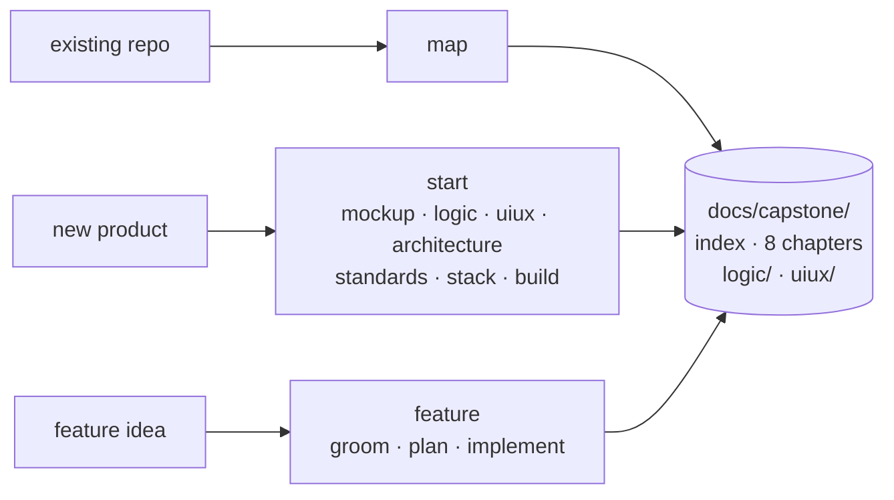

# Capstone

Architecture docs your AI agent reads instead of re-exploring the repo
every session. Stamped to commits, refreshed only where the code
moved. For new projects, an interview pipeline that designs the whole
thing before building it.



**Jump to:**

1. [Install](#install)
2. [Update](#update)
3. [Where to start](#where-to-start)
4. [What you get](#what-you-get)
5. [Commands](#commands)
6. [The greenfield pipeline](#the-greenfield-pipeline)
7. [The feature chain](#the-feature-chain)
8. [What `review` is](#what-review-is)
9. [Not technical? Still yours](#not-technical-still-yours)

Full detail on every command: **[docs/commands.md](docs/commands.md)**.

Works in Claude Code, Copilot CLI, Gemini CLI, Antigravity, and
OpenCode. Plain `SKILL.md` files, MIT.

---

## Install

### Claude Code

```text
/plugin marketplace add GentBajko/capstone
/plugin install capstone@capstone-marketplace
```

### GitHub Copilot

```bash
gh skill install GentBajko/capstone --all --agent github-copilot
```

### Any other agent

70+ editors and CLIs via the skills CLI:

```bash
npx skills add GentBajko/capstone
```

Per-agent commands and the bare-`/capstone` alias are under
"Installing on other agents" below.

## Update

No reinstall needed. Update in place:

| Installed with | Update with |
| --- | --- |
| Claude Code plugin | `claude plugin marketplace update capstone-marketplace`<br>then `claude plugin update capstone@capstone-marketplace` |
| `gh skill` | `gh skill update capstone` |
| `npx skills` | `npx skills update` |

The Claude Code pair is two steps on purpose: the first refreshes the
marketplace clone, the second moves your install onto it. Restart to
apply. To skip it entirely, turn on auto-update: `/plugin` →
Marketplaces → capstone-marketplace → Enable auto-update.

> [!IMPORTANT]
> **Updates are additive.** `gh skill update` and `npx skills update`
> refresh files but never delete a skill that capstone has retired, so
> a removed command lingers on disk and keeps being offered to your
> agent. After any release that drops commands, compare
> `gh skill list` or `npx skills list` against the command tables
> below and remove whatever is no longer there.

---

## Where to start

| Situation | Command |
| --- | --- |
| A repo that already has code | `/capstone:map` |
| A product that doesn't exist yet | `/capstone:start` |
| One change to a mapped project | `/capstone:feature add CSV export` |

Everything else is a stage one of those runs, invocable on its own
when you want to enter mid-chain.

## What you get

`/capstone:map` produces a `00-index.md`, eight numbered chapters
beside it in `docs/capstone/`, and a `logic/` folder mapping the
observed business logic scenario by scenario:

```text
01-architecture.md   layers, boundaries, entry points, dispatch tables
02-models.md         entities, relationships, schema DDL, validation
03-conventions.md    paradigm, typing level, error handling, DI
04-data-flow.md      lifecycles hop by hop, state ownership, failure paths
05-dependencies.md   every package, what it's for, where it's wired
06-testing.md        layout, test doubles, coverage shape
07-operations.md     how to run it, env vars, infra, deploy
08-glossary.md       the domain words your codebase invented
```

Everything is facts with `file:line` citations, never advice. Every
file records the commit it was derived at and the globs it covers, so
a later run rewrites only what actually moved — and every command
declares what it reads before acting, so re-runs don't burn tokens
re-exploring what the docs already know.

A command that needs the reference and finds none builds it first
instead of sending you off to run something else.

## Commands

**Reference**

| Command | What it does |
| --- | --- |
| `/capstone:map` | Build the reference, or refresh only what drifted. `rebuild` forces a full rewrite; a topic name targets one chapter |
| `/capstone:map check` | Read-only trust report: staleness, pointer drift, absorption drift, coverage gaps, stack re-vetting. Writes nothing |
| `/capstone:doctor` | Diagnose and repair the docs area: torn writes, index drift, voided approvals, absorption gaps |
| `/capstone:review [be\|fe]` | The opt-in judgment → `review.md`. No argument does both sides; `backend` takes architecture, `frontend` grades the UI against your own design docs |

**Greenfield pipeline** — `/capstone:start` runs these in order

| Command | What it does |
| --- | --- |
| `/capstone:mockup` | Product discovery → one file per screen |
| `/capstone:logic` | Business logic, scenario by scenario |
| `/capstone:uiux` | How the UI looks and the UX behaves |
| `/capstone:architecture` | The big design interview → prescriptive chapters |
| `/capstone:standards` | How code should be written here |
| `/capstone:stack` | Research libraries and services per capability; you pick |
| `/capstone:build` | Implementation plan, your approval, then working code |

**Feature chain** — `/capstone:feature` runs these in order

| Command | What it does |
| --- | --- |
| `/capstone:groom <feature>` | Doc-grounded feature interview → a traceable spec |
| `/capstone:plan <feature>` | Task-by-task TDD plan; you approve before any code |
| `/capstone:implement <feature>` | Execute the plan, review until dry, absorb back into the docs |

Plus `/capstone:help` for usage — in Claude Code a hook answers it
before the model is invoked, so it costs zero tokens.

Not a command: `docs/capstone/changelog.md`, the append-only ledger
every writing command records itself in before it sets its done
marker.

**[Full command reference →](docs/commands.md)** — every argument,
output, prerequisite, ledger key, and the shared mechanics.

---

## The greenfield pipeline

```text
mockup → logic → uiux → architecture → standards → stack → build
```

Type `capstone` and it runs the stages in order, resuming wherever you
stopped. Every answer is written to disk before the next question, so
a dead session loses nothing. Each interview takes an optional
artifact (a PRD, screenshots) and pre-fills what it answers. On
existing codebases, `logic` and `uiux` run in reverse: they draft
from the observed code and you confirm.

**mockup**. Product discovery. Three fixed questions, then every
question after that is generated from your answers until nothing is
left to invent. One file per screen: ASCII wireframe, exact copy and
behavior, the empty/error/success states. No visual UI? It records
your surfaces (api, cli) and the uiux stage skips itself.

**logic**. One scenario at a time, walked until a developer could
implement it without inventing a single rule: exact steps, real
formulas, what happens when the payment fails or the user clicks
twice. The part of a spec everyone skips and then pays for.

**uiux**. How it looks and feels: a design read, the visual world,
the tokens, each screen's composition and states. The method is
vendored, distilled from `impeccable` (Apache-2.0) and
`design-taste-frontend` (MIT), so the same product designs the same
way on any machine.

**architecture**. The big interview. Done only when every section of
the future docs is answerable from your recorded decisions. Writes
the same eight chapters, marked prescriptive; once code exists,
`map` replaces intent with observation.

**standards**. Typing strictness, library versus hand-rolled, error
handling, what an AI must never do in your repo. Also a decent
starting point for a CLAUDE.md.

**stack, then build**. `stack` researches real options per
capability, licenses and prices included; you pick, and
`stack refresh` re-vets the picks months later. `build` writes an
implementation plan, stops for your approval, then writes the code:
one subagent per step with fresh context, or inline, whichever you
pick when it starts.

## The feature chain

`/capstone:feature add CSV export` grows a finished project one
feature at a time. `groom` interviews a spec out of you against the
reference. `plan` turns it into a task-by-task TDD plan; a vendored
TDD + YAGNI ladder trims every task, and your standards outrank the
ladder on conflict. `implement` executes, reviews the diff until two
consecutive rounds find nothing new, then absorbs the shipped
behavior back into the scenario docs. A dead session resumes
mid-chain.

## What `review` is

The one command allowed opinions, only when invoked. Two sides, one
`docs/capstone/review.md`, each section carrying its own stamp so you
can tell how old each half is.

The **frontend** side judges the UI against your own design docs
first, then a vendored craft floor, then each screen's mode,
screenshotting the live app when it can. The **backend** side covers
architecture and backend: shallow modules by the deletion test,
change-smells in the git hot paths, security, stack currency.

Bare `review` runs both; one argument runs one side and rewrites only
that section. Both judge by capstone's own vendored craft files, so
the same codebase is judged the same way on any machine. One rule
outranks the craft baseline: **your recorded decisions beat generic
best practice.** Gitignored by default — it is judgment, not
reference.

## Not technical? Still yours

Set `expertise: 1` and everything happens in plain language: capstone
asks how many people might use the thing rather than what your p99
latency budget is, derives the technical targets itself, and confirms
them in words you can sanity-check. Set `teaching_mode: true` and it
narrates what it's doing and why as it works, naming the proper term
for each concept, one per step, so you learn the craft along the way.
The output stays rigorous either way. Engineers set `expertise: 5` for
terse questions and trade-off tables.

---

<details>
<summary>Settings</summary>

Installing creates `~/.claude/capstone.json` (the first session after
install runs the plugin's SessionStart hook): one config for the
user, shared by every project.

```json
{
  "expertise": null,
  "teaching_mode": false,
  "docs_dir": "docs/capstone",
  "index_file": "docs/capstone/00-index.md",
  "subagent_threshold": 150,
  "docs_in_git": "ask",
  "language": "en"
}
```

| Key | What it does |
| --- | --- |
| `expertise` | 1–5, asked once and saved. Calibrates the conversation only, never the docs |
| `teaching_mode` | Narrate and teach while working, at any expertise level |
| `docs_dir` | Where generated docs live. Relocates outputs only — the project config's own path never moves |
| `index_file` | Chapter zero of the docs area |
| `subagent_threshold` | Source-file count above which `map` fans out subagents, and above which an unrequested full build asks first |
| `docs_in_git` | `commit`, `ignore`, or `ask`, for the factual reference |
| `language` | The generated docs' language |

Interviews, `features/`, and `review.md` stay local via a generated
`.gitignore`. **`changelog.md` is the one exception and is always
committed**: `implement` deletes a feature's folder once its ledger
entry is written, so the ledger is the only surviving record of why
the feature was built that way.

Project-scoped state lives in an optional
`docs/capstone/capstone.json`, created only when there is something to
record; any global key set there overrides the global file for that
repo. `pipeline` records the one-time pipeline-or-map choice on repos
that already have code, and `workspaces` gives each monorepo workspace
its own docs area with the root project's `00-index.md` as an
index-of-indexes.

</details>

<details>
<summary>Installing on other agents</summary>

Whichever installer you use, take **all** capstone skills: `core`
carries the shared rules every other command reads, so a partial
install fails at the first command that needs it. `--all` and
`--skill '*'` do that; so does accepting the default.

**GitHub Copilot**, via the GitHub CLI:

```bash
gh skill install GentBajko/capstone --all --agent github-copilot
```

`gh skill` also installs to Claude, Cursor, Gemini, Antigravity and
others — swap `--agent`, or drop the flag to be asked. Copilot CLI's
own marketplace format works too:

```bash
copilot plugin marketplace add GentBajko/capstone
copilot plugin install capstone@capstone-marketplace
```

**The skills CLI**, covering 70+ agents:

```bash
npx skills add GentBajko/capstone
```

**Gemini CLI**: `gemini extensions install https://github.com/GentBajko/capstone`

**Antigravity**: `agy plugin install https://github.com/GentBajko/capstone`

**OpenCode**, in `opencode.json`:

```json
{ "plugin": ["capstone@git+https://github.com/GentBajko/capstone.git"] }
```

Commands come out namespaced (`/capstone:map`). For a bare
`/capstone` in Claude Code, drop this in `~/.claude/commands/capstone.md`:

```markdown
---
description: Capstone entry - no args runs the pipeline; args route to the matching skill
argument-hint: [command] [args...]
---

No arguments: invoke the capstone:start skill. If the first argument
matches a capstone skill (map, doctor, review,
mockup, logic, uiux, architecture, standards,
stack, build, groom, plan, implement, feature, start, help),
invoke capstone:<that skill> with the remaining arguments.

ARGUMENTS: $ARGUMENTS
```

</details>

<details>
<summary>CI</summary>

Copy `templates/capstone-map-check.yml` into `.github/workflows/`,
add an `ANTHROPIC_API_KEY` secret, and every PR fails when the
reference is stale.

**Upgrading from 4.x:** `generate` and `sync` merged into `map`, and
the verdict line the CI job greps changed from `SYNC CHECK:` to
`MAP CHECK:`. An old `capstone-sync-check.yml` fails loudly with
"no SYNC CHECK verdict found" rather than passing silently, but
replace it with the template above. Existing `generate/` and `sync/`
keys in `changelog.md` are history and stay as they are; nothing
reads them.

</details>

<details>
<summary>Rough edges</summary>

The zero-token help trick is Claude Code only.

Every script is bash, so Windows needs Git Bash (which ships with Git
for Windows, and which the SessionStart hook has always required);
Windows field-testing is thin either way.

Budget an afternoon for the `logic` interview on a real app; the depth
is the point.

Retrieval is grep over eight markdown files — plenty at this scale,
unproven on giant monorepos.

</details>

---

MIT. Issues and PRs welcome.
