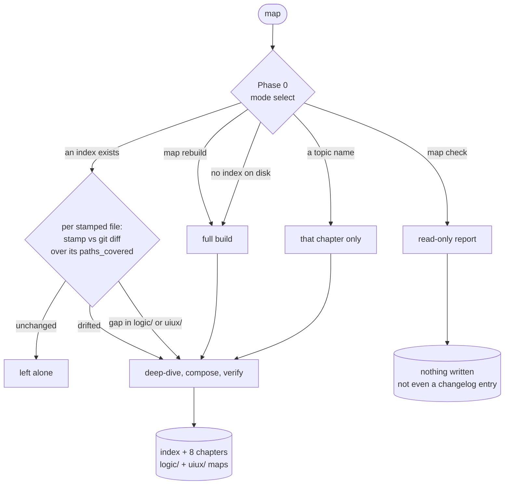
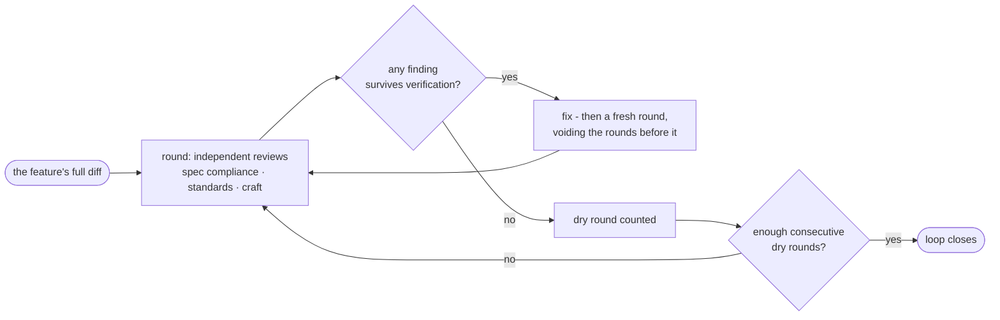
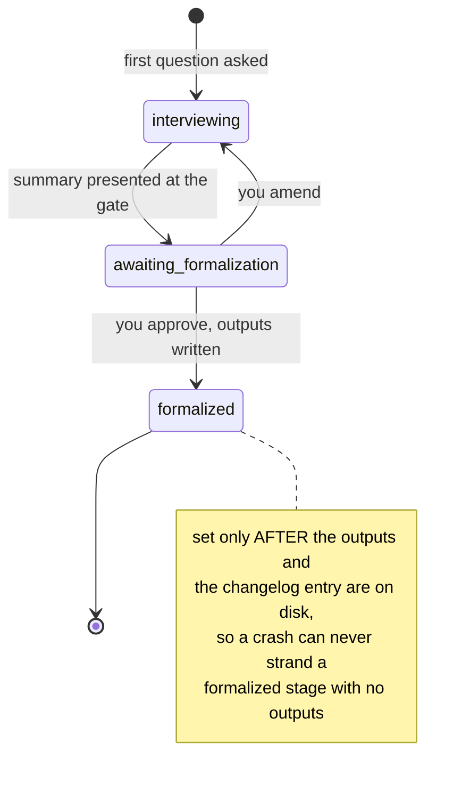

# How each capstone command runs

Three entry points: what each does, in what order, where it stops for
you, and what it leaves on disk. [commands.md](commands.md) is the
reference for every command and its arguments; this file is the
mechanics behind the three that run a whole process.

**Jump to:**

1. [Picking an entry point](#picking-an-entry-point)
2. [`map` - the reference, built and kept true](#map---the-reference-built-and-kept-true)
3. [`start` - the greenfield pipeline](#start---the-greenfield-pipeline)
4. [`feature` - idea to shipped code](#feature---idea-to-shipped-code)
5. [What every stage has in common](#what-every-stage-has-in-common)

---

## Picking an entry point

| You have | Run | It produces |
| --- | --- | --- |
| A repo with code in it | `map` | The reference, from what the code does |
| An idea and no code | `start` | The reference from what you decide, then the code |
| A shipped product and one new thing | `feature` | One feature's spec, plan, and code, absorbed back |

They are phases of one life rather than alternatives. `start` builds a
product that does not exist; `map` takes over once code does, replacing
intent with observation; `feature` grows what shipped and hands its
knowledge back to the same reference.

---

## `map` - the reference, built and kept true

One verb for build, refresh, and report - which is why there is no
separate "update" command to forget to run. What happens depends on
what it finds:

**How drift is detected.** Every generated file carries frontmatter
stamps: the commit it was derived at, the capstone version that wrote
it, and `paths_covered` - the globs its claims come from. The refresh
runs `git diff` between that stamp and the **working tree** over exactly
those globs, so uncommitted work counts. Only what moved gets rewritten.

**The prescriptive-to-observed flip.** Chapters written by `start` are
marked `mode: prescriptive` - decisions, not observations. Once any
tracked source exists, such a file is stale *by definition*: the plan
said where code was going to land, and code lands where it lands. The
refresh rewrites it descriptively and records divergences as facts,
preserving the design decision and rationale inline beside the observed
implementation (`file:line`).

**`map check` writes nothing**, including no changelog entry - nothing
was done, only read. Six parts: staleness, pointer drift, absorption
drift, coverage gaps, stack re-vetting, and a machine-readable verdict
line CI can grep.

---

## `start` - the greenfield pipeline

Seven interviews in order, each resumable, each gated before it writes.
Typing bare `capstone` runs this.

| # | Stage | Settles | Produces |
| --- | --- | --- | --- |
| 1 | `mockup` | What exists: screens, journeys, the behavior inventory, the commercial model | `mockup/` |
| 2 | `logic` | What happens: rules, branches, unhappy paths, invariants | `logic/` |
| 3 | `uiux` | How it looks and behaves | `uiux/` |
| 4 | `architecture` | How the system is built | The 8 chapters, `mode: prescriptive` |
| 5 | `standards` | How code is written here | `standards.md` |
| 6 | `stack` | What it is built with | `05-dependencies.md` |
| — | *readback* | Nothing. It re-files and reconciles what stages 1-6 recorded | Amended final outputs |
| 7 | `build` | The implementation plan, then the code | `implementation.md`, source |

Each stage feeds the next, and skipping ahead is not possible: `uiux`
requires a formalized `mockup`, `build` requires a formalized `stack`.

**The readback, between `stack` and `build`.** Earlier stages cannot
see every later final output, which leaves two things nobody catches.
It runs in two halves, misplacement first so the second cites final
locations:

1. **Re-file.** Against core.md's Stage ownership table, every decision
  whose subject belongs to another stage - a business rule in an
  architecture chapter, a library choice in `standards.md`.
   Re-filing is not re-deciding, so it arrives as one digest you
   confirm, not a finding per turn.
2. **Reconcile.** Every decision contradicting one recorded elsewhere,
   raised one per turn with both citations, under the usual two-round
   cap. Then your answer stands.

Either half amends the owning final outputs, their index boundaries,
stamps, and changelog entries. Completed interview bodies are not read
or amended. The pass records a stable hash of the six latest stage
keys under `readback/all@<stamp>`, so unchanged outputs skip.

**`build` is the only pipeline stage that writes source code**, and only
after you approve its plan. `implementation.md` maps every scenario,
screen, and component to the step that implements it; a row with no step
is a gap in the plan, and the plan gets fixed rather than the table.

---

## `feature` - idea to shipped code

Three stages, two approval gates, and a review loop that has to prove
itself finished.

| Stage | Stops for you at | Produces |
| --- | --- | --- |
| `groom` | The spec gate | `spec.md`, every requirement traced to a `§Q` |
| `plan` | The plan gate | `plan.md`, task-by-task TDD |
| `implement` | Nothing - it runs to completion | Code, refreshed chapters, a changelog entry |

**Grooming is doc-grounded.** It reads the chapters the feature touches
first, so it asks about the feature instead of re-asking what the
reference already answers.

**A plan approval can go stale.** It records `plan_approved: true` *and*
a checksum of the spec it was approved against. Edit the spec and the
approval is void - the plan is re-gated rather than silently executed
against requirements that changed underneath it.

**The review loop is recursive on purpose**, because a single pass
cannot catch the bugs its own fixes introduce:

Its state lives in `review-ledger.md` beside the plan - every finding
ever raised with its verdict, plus the dry-round count - so a resumed
session picks the loop up instead of restarting at round one.

**The wrap is where a feature stops being local.** `features/` is never
committed, so its knowledge has to move before the folder goes: the
chapters the spec named are refreshed against what was actually built,
then the spec is **absorbed** - behavior into `logic/`, changed screens
into `mockup/`, restyled chapters into `uiux/`, each stamped
`absorbed_from`. Only then is the changelog entry written and the folder
deleted. That entry is all that survives it, which is why it has to be
readable with no spec beside it.

---

## What every stage has in common

**Nothing is generated before you approve it.** Every interview moves
through the same three states, and a resumed run re-presents the gate
rather than taking silence for a yes:

`logic` is the one exception: it gates per scenario rather than once at
the end, so it stays `interviewing` with a scenario checklist in its
frontmatter until every scenario is written or dropped.

**Every write is recorded before it counts as done.** A run writes its
changelog entry (a `changelog.d/` fragment, folded into
`changelog.md` on main) *before* setting its done marker. That order is what
makes a crash diagnosable rather than ambiguous: outputs with no marker
regenerate from the recorded decisions, and a marker with no entry is
provably a torn write that `doctor` repairs - neither case re-interviews
you.

**Stopping is always safe.** Every stage persists its state before
asking the next question, so the answer to "can I stop here?" is yes,
everywhere.

**Your decisions outrank the method.** Every interview will challenge an
answer that conflicts with something recorded, a craft rule, or a number
you already gave - on evidence, with a citation, never more than twice.
Then it is yours: recorded with the objection beside it, and never
reopened.
