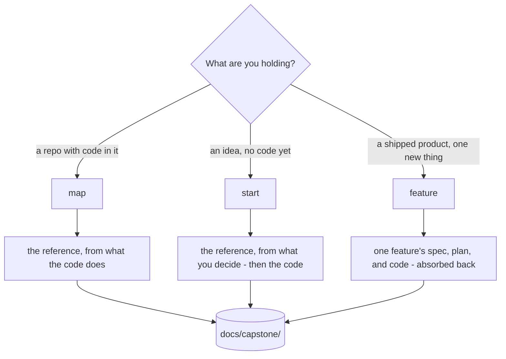
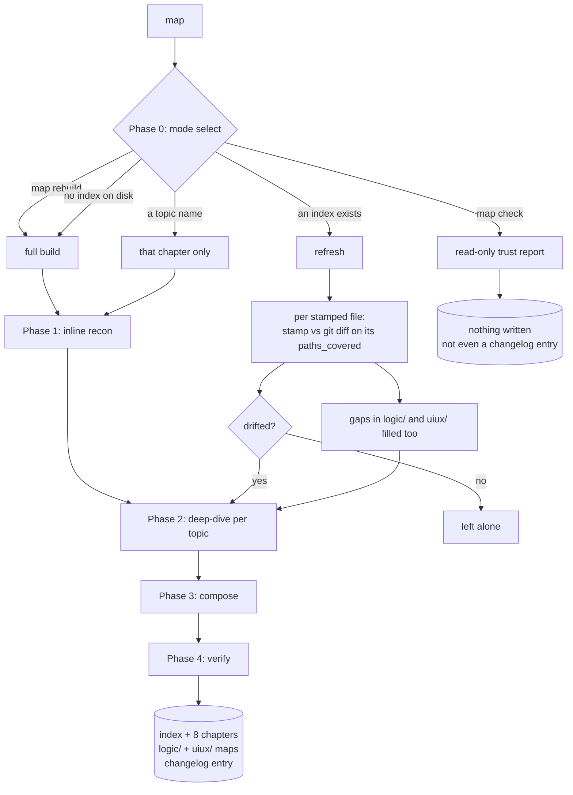
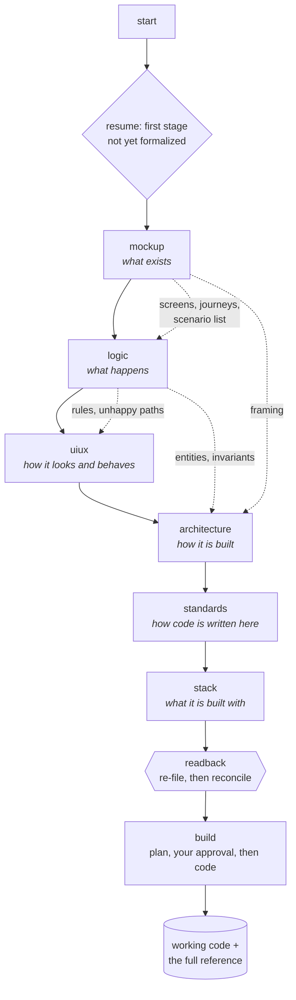
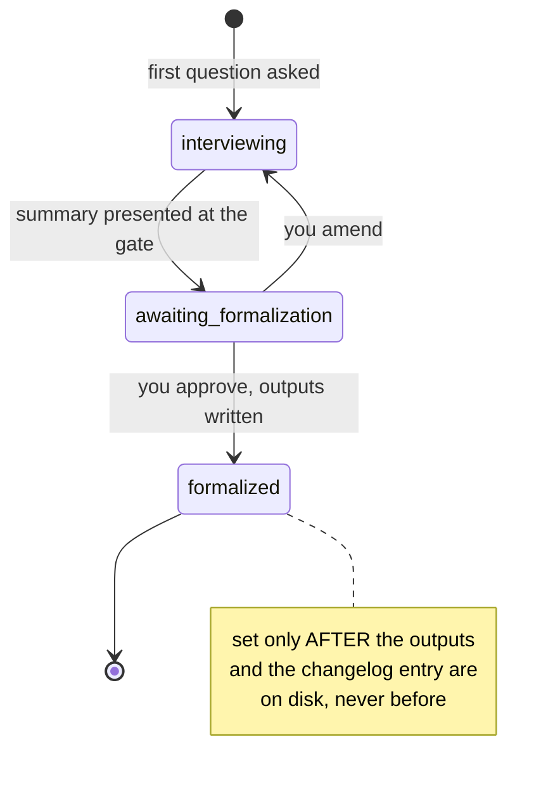
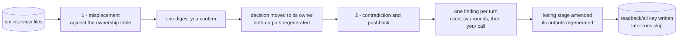
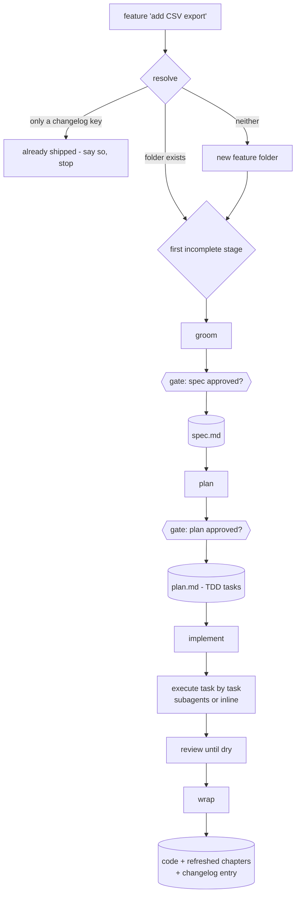
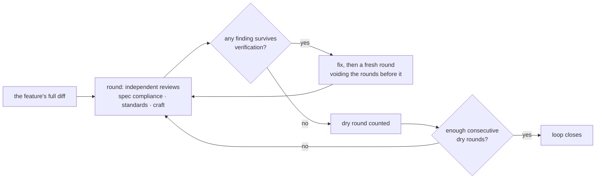
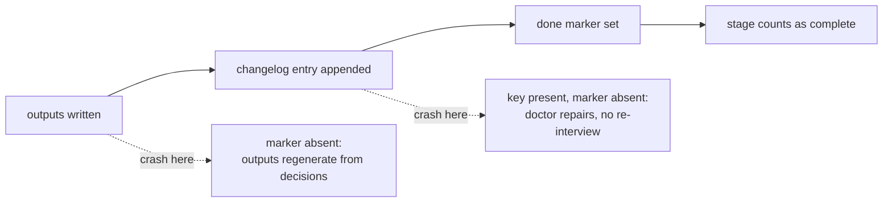

# How each capstone command runs

Three entry points, drawn out: what each one does, in what order, where
it stops for you, and what it leaves on disk. [commands.md](commands.md)
is the reference for every command and its arguments; this file is the
mechanics behind the three that run a whole process.

**Jump to:**

1. [Picking an entry point](#picking-an-entry-point)
2. [`map` - the reference, built and kept true](#map---the-reference-built-and-kept-true)
3. [`start` - the greenfield pipeline](#start---the-greenfield-pipeline)
4. [`feature` - idea to shipped code](#feature---idea-to-shipped-code)
5. [What every stage has in common](#what-every-stage-has-in-common)

---

## Picking an entry point

They are not alternatives so much as phases of one life. `start` builds
a product that does not exist; `map` takes over once code does, turning
intent into observation; `feature` grows what shipped, one change at a
time, and hands its knowledge back to the same reference.

---

## `map` - the reference, built and kept true

One verb for build, refresh, and report. What it does depends on what it
finds, which is why there is no separate "update" command to forget to
run.

**How it decides.** Every generated file carries frontmatter stamps:
the commit it was derived at, the capstone version that wrote it, and
`paths_covered`, the globs its claims come from. A refresh runs
`git diff` between the stamp and the working tree over exactly those
globs, so uncommitted work counts as drift. Only the files that moved
get rewritten.

**The prescriptive-to-observed flip.** Chapters written by `start` are
marked `mode: prescriptive` - decisions, not observations. Once any
tracked source exists, such a file is **stale by definition**: the plan
described where code was going to land, and code lands where it lands.
The refresh rewrites it descriptively and records the divergences as
facts, citing both sides ("designed as X per `architecture-interview.md`
§Q7, implemented as Y at `file:line`").

**`map check` writes nothing at all**, including no changelog entry -
nothing was done, only read. Six parts: staleness, pointer drift,
absorption drift, coverage gaps, stack re-vetting, and a machine-readable
verdict line CI can grep for.

---

## `start` - the greenfield pipeline

Seven interviews in order, each one resumable, each gated on your
approval before it writes. Typing bare `capstone` runs this.

**Every stage is the same shape.** An interview file on disk records
each `### Q<n>` before the next question is asked, so a dead session
loses nothing and a resumed one never re-asks. When the questions run
out the stage presents a summary and stops: nothing is generated until
you formalize it.

`logic` is the one exception: it gates per scenario rather than once at
the end, so it stays `interviewing` with a scenario checklist in its
frontmatter until every scenario is written or dropped.

**The readback, between `stack` and `build`.** No interview can see
another one's answers, which leaves two things nobody catches: a
decision recorded in the wrong stage, and two stages deciding the same
thing differently.

Misplacement runs first so the contradiction half cites final locations.
Re-filing is not re-deciding, so it arrives as one digest rather than a
question per finding.

**`build` is the only stage that writes source code**, and only after
you approve its plan. `implementation.md` maps every scenario, screen,
and component to the build step that implements it; a row with no step
is a gap in the plan, and the plan gets fixed rather than the table.

---

## `feature` - idea to shipped code

Three stages, two approval gates, and a review loop that has to prove
itself finished.

**Grooming is doc-grounded.** It reads the chapters the feature touches
first, so it asks about the feature rather than re-asking what the
reference already answers, and every requirement in the spec traces back
to a `§Q` you gave.

**A plan approval can go stale.** It records both `plan_approved: true`
and a checksum of the spec it was approved against. Edit the spec and
the approval is void - the plan is re-gated rather than silently
executed against requirements that changed underneath it.

**The review loop is recursive on purpose.** A single pass cannot catch
the bugs its own fixes introduce.

Its state lives in `review-ledger.md` beside the plan: every finding ever
raised with its verdict and the dry-round count, so a resumed session
picks the loop up instead of restarting at round one.

**The wrap is where a feature stops being local.** `features/` is
never committed, so the knowledge has to move before the folder goes:

1. The chapters the spec named are stale by construction - `map`
   refreshes them against what was actually built.
2. The spec is **absorbed**: its behavior merges into `logic/`, the
   screens it changed into `mockup/`, the chapters it restyled into
   `uiux/`. Everything absorbed is stamped `absorbed_from`.
3. The changelog entry is written - and then the feature folder is
   deleted, which is why that entry has to be readable with no spec
   beside it. It is all that survives.

---

## What every stage has in common

**Nothing is generated before you approve it.** Every gate sets
`awaiting-formalization` and waits. A resumed run re-presents the gate;
it never takes silence for a yes.

**Every write is recorded before it counts as done.** A run appends its
entry to `changelog.md` *before* setting its done marker, so a marker
with no entry is provably a torn write - and `doctor` repairs it from
the recorded decisions rather than re-interviewing you.

**Stopping is always safe.** Every stage persists its state before the
next question, so the answer to "can I stop here?" is yes, everywhere,
and the next run resumes exactly where you left off.

**Your decisions outrank the method.** Every interview will challenge an
answer that conflicts with something recorded, a craft rule, or a number
you already gave - on evidence, with a citation, and never more than
twice. Then it is yours, it gets recorded with the objection beside it,
and nothing reopens it later.
